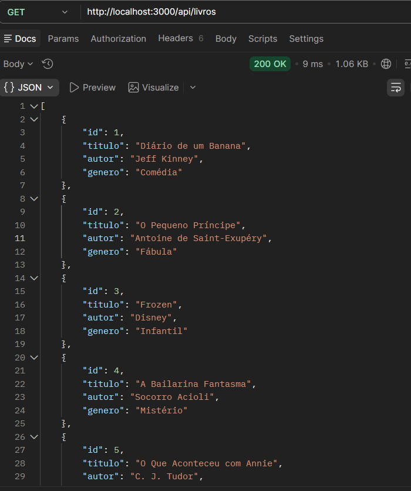

# API de Livros

## Sobre o projeto
API desenvolvida com Node.js e Express para cadastro e consulta de livros.

---

## Endpoints

### GET /api/livros
Lista todos os livros.

### GET /api/livros/:id
Busca um livro pelo ID.

### POST /api/livros
Cadastra um novo livro.

---

## Testes

### GET - listar livros


### GET - livro por id


### POST - cadastro


### Erro de validação


### GET final


---

## Validações implementadas

Na rota de cadastro de livros (POST /api/livros), foi implementada uma validação para garantir que os dados obrigatórios sejam enviados corretamente.

A API verifica se os campos **titulo**, **autor** e **genero** foram informados na requisição.

Caso algum desses campos não seja enviado, a API retorna:

- Status HTTP: **400 (Bad Request)**
- Mensagem de erro informando que os campos são obrigatórios

Exemplo de resposta de erro:

```json
{
  "erro": "Todos os campos são obrigatórios: titulo, autor e genero"
}